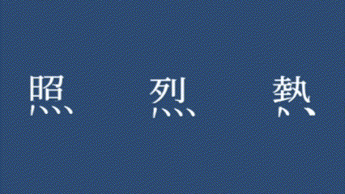
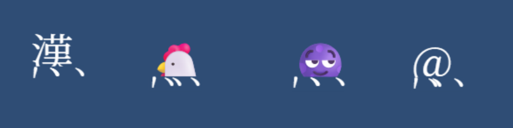

# kasakasa-Kanji

Preview 
https://puru28aa.github.io/kasakasa-Kanji/

"Four Dots Kanji Animation".

This interactive web application allows users to input Japanese kanji characters featuring "four dots" (「、、、、」) beneath them. The kanji characters move randomly across the screen, while the four dots vibrate horizontally, creating a lively, insect-like effect. 
Users can choose between random kanji selection or manually enter up to four kanji. Additional customization options include adjusting movement speed, offset position, and the background color.  
「四つ点の漢字アニメーション」

このインタラクティブなWebアプリは、下部に「四つ点」（「、、、、」）を持つ日本語の漢字を入力し、その漢字が画面内をランダムに動き回ります。四つ点は左右に振動し、生き物のように見える効果を演出します。 
ユーザーはランダムに漢字を選択するか、最大4つまで手動で入力できます。また、移動速度、オフセット位置、背景の色を調整することも可能です。  

Note: The application is designed for kanji characters with "four dots." Inputting other kanji may cause display issues. 
補足: このアプリは「四つ点」を持つ漢字を対象としています。それ以外の漢字を入力すると、表示が崩れる可能性があります。

